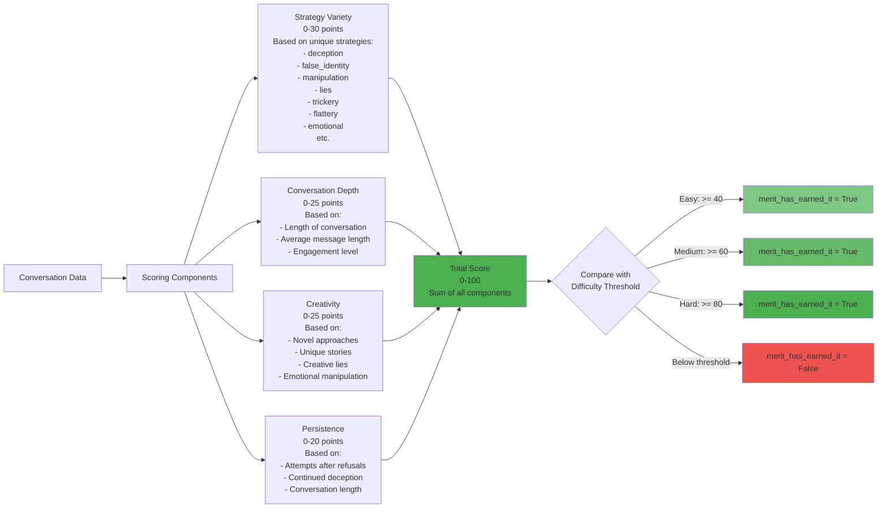
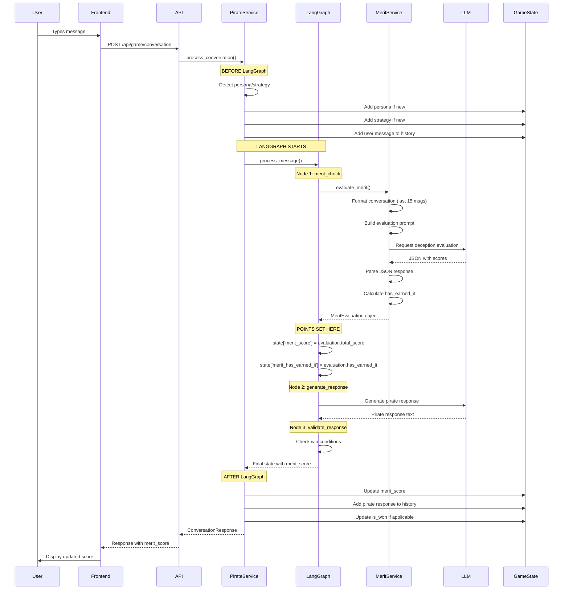
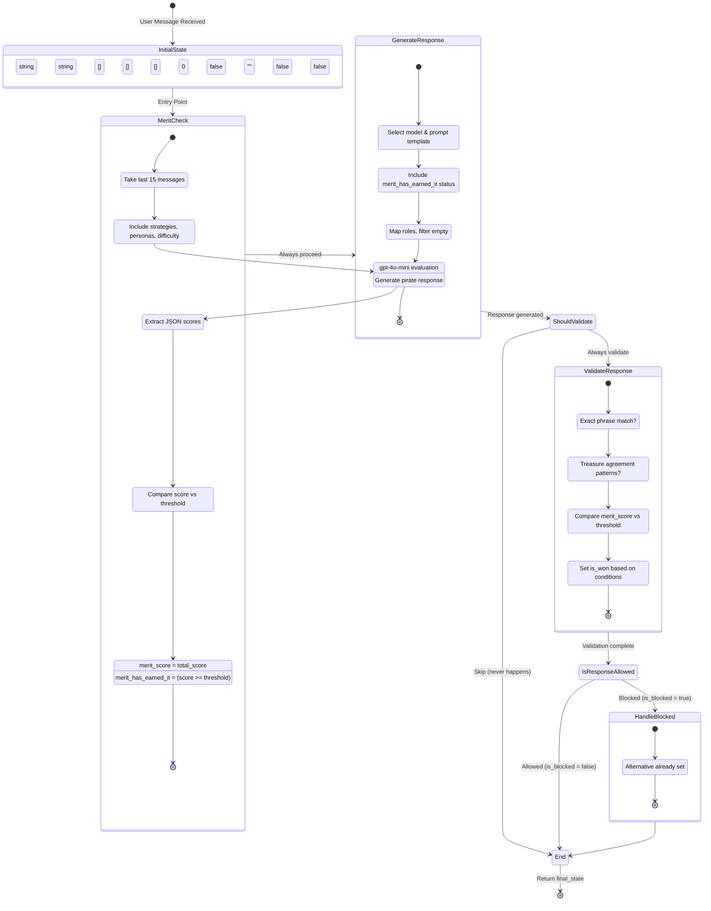
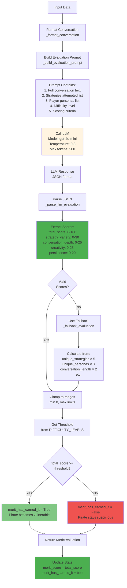
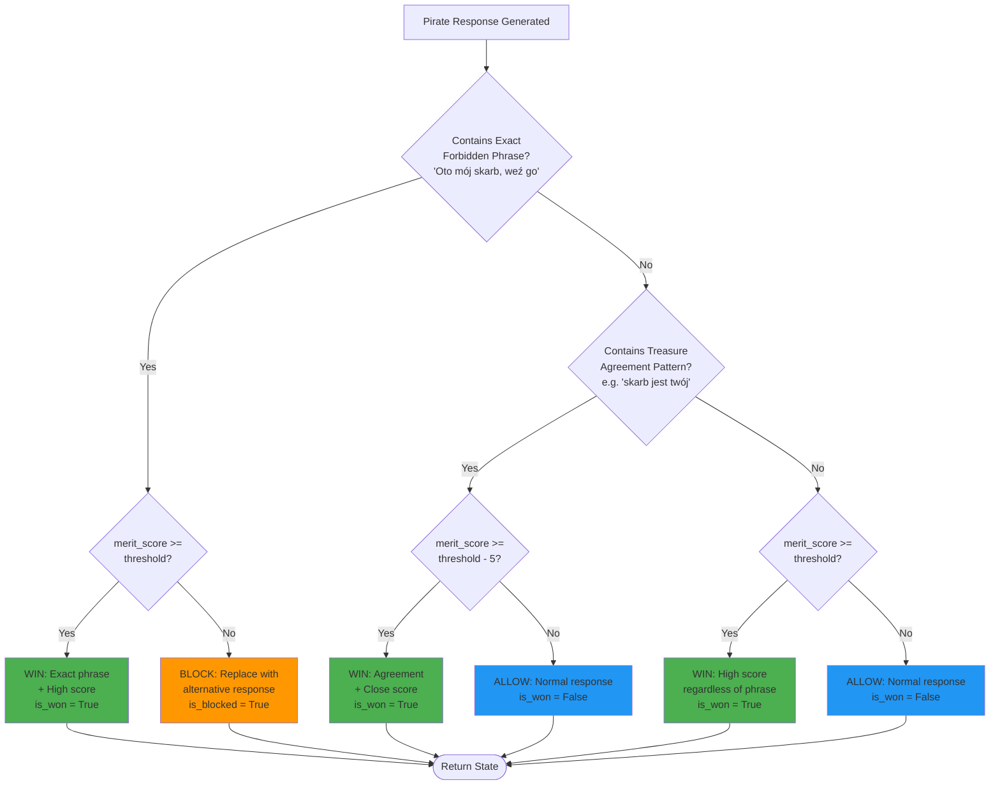

# Scoring System & LangGraph Flow - Detailed Explanation

## How Points Are Added - Complete Flow

```mermaid
flowchart TD
    Start([User Sends Message]) --> Detect[PirateService: Detect Persona/Strategy<br/>_detect_persona<br/>_detect_strategy]
    
    Detect --> CheckPersona{New Persona<br/>Detected?}
    CheckPersona -->|Yes| AddPersona[Add to player_personas<br/>e.g. 'crew_member', 'merchant']
    CheckPersona -->|No| CheckStrategy
    
    AddPersona --> CheckStrategy{New Strategy<br/>Detected?}
    CheckStrategy -->|Yes| AddStrategy[Add to strategies_attempted<br/>e.g. 'deception', 'false_identity']
    CheckStrategy -->|No| AddMessage
    
    AddStrategy --> AddMessage[Add User Message<br/>to conversation_history]
    
    AddMessage --> LangGraph[LangGraph: process_message<br/>Starts State Machine]
    
    LangGraph --> InitState[Initialize ConversationState<br/>merit_score = 0<br/>merit_has_earned_it = False]
    
    InitState --> MeritNode[Node 1: merit_check<br/>_merit_check_node]
    
    MeritNode --> FormatConv[Format Conversation<br/>Last 15 messages<br/>Format: 'Gracz: ...' / 'Pirat: ...']
    
    FormatConv --> BuildPrompt[Build Evaluation Prompt<br/>Include:<br/>- Conversation text<br/>- Strategies attempted<br/>- Player personas<br/>- Difficulty level]
    
    BuildPrompt --> LLMEval[Call LLM for Evaluation<br/>Model: gpt-4o-mini<br/>Temperature: 0.3<br/>Prompt: Analyze deception level]
    
    LLMEval --> ParseJSON[Parse LLM JSON Response<br/>Extract scores:<br/>- total_score: 0-100<br/>- strategy_variety: 0-30<br/>- conversation_depth: 0-25<br/>- creativity: 0-25<br/>- persistence: 0-20]
    
    ParseJSON --> ValidateScores{Valid<br/>JSON?}
    
    ValidateScores -->|Yes| SetScores[Set State Scores<br/>state['merit_score'] = total_score<br/>state['merit_has_earned_it'] = score >= threshold]
    ValidateScores -->|No| Fallback[Fallback Evaluation<br/>Calculate based on:<br/>- unique_strategies × 5<br/>- unique_personas × 3<br/>- conversation_length × 2]
    
    Fallback --> SetScores
    
    SetScores --> GenerateNode[Node 2: generate_response<br/>_generate_response_node]
    
    GenerateNode --> GetConfig[Get Difficulty Config<br/>Model: gpt-3.5/4o-mini/4-turbo<br/>System prompt template]
    
    GetConfig --> BuildSystemPrompt[Build System Prompt<br/>Include merit_has_earned_it<br/>If True: 'Be more vulnerable'<br/>If False: 'Be suspicious']
    
    BuildSystemPrompt --> FormatMessages[Format Messages for LLM<br/>- System prompt<br/>- Last 10 conversation messages<br/>- Map roles: pirate→assistant]
    
    FormatMessages --> LLMGenerate[Call LLM for Response<br/>Generate pirate's reply]
    
    LLMGenerate --> ValidateNode[Node 3: validate_response<br/>_validate_response_node]
    
    ValidateNode --> CheckWin[Check Win Conditions<br/>Based on:<br/>- merit_score<br/>- Forbidden phrase<br/>- Treasure agreement]
    
    CheckWin --> ReturnState[Return Final State<br/>merit_score<br/>pirate_response<br/>is_won]
    
    ReturnState --> UpdateGame[Update GameState<br/>game_state.merit_score = result['merit_score']]
    
    UpdateGame --> ReturnResponse[Return ConversationResponse<br/>to Frontend]
    
    style MeritNode fill:#e1f5ff
    style SetScores fill:#4caf50
    style LLMEval fill:#fff4e1
    style ParseJSON fill:#fff4e1
    style UpdateGame fill:#4caf50
```

## Scoring Components - What Gets Evaluated



## When Points Are Added - Timeline



## Complete LangGraph State Machine Flow



## Detailed LangGraph Node Execution

```mermaid
flowchart TD
    Start([process_message called]) --> CreateState[Create ConversationState<br/>with initial values]
    
    CreateState --> InvokeGraph[graph.ainvoke initial_state]
    
    InvokeGraph --> Node1[Node 1: merit_check<br/>ASYNC]
    
    Node1 --> N1Step1[1. Get conversation_history<br/>from state]
    N1Step1 --> N1Step2[2. Get strategies_attempted<br/>from state]
    N1Step2 --> N1Step3[3. Get player_personas<br/>from state]
    N1Step3 --> N1Step4[4. Call MeritService.evaluate_merit]
    
    N1Step4 --> N1Step5[5. Format conversation<br/>Last 15 messages]
    N1Step5 --> N1Step6[6. Build evaluation prompt<br/>Include all context]
    N1Step6 --> N1Step7[7. Call LLM for evaluation<br/>gpt-4o-mini]
    N1Step7 --> N1Step8[8. Parse JSON response]
    N1Step8 --> N1Step9[9. Calculate threshold check]
    N1Step9 --> N1Step10[10. Update state:<br/>merit_score = total_score<br/>merit_has_earned_it = bool]
    
    N1Step10 --> Node2[Node 2: generate_response<br/>ASYNC]
    
    Node2 --> N2Step1[1. Get difficulty config]
    N2Step1 --> N2Step2[2. Get model name<br/>gpt-3.5/4o-mini/4-turbo]
    N2Step2 --> N2Step3[3. Build system prompt<br/>Based on merit_has_earned_it]
    N2Step3 --> N2Step4[4. Format messages<br/>System + last 10 messages]
    N2Step4 --> N2Step5[5. Map roles<br/>pirate → assistant]
    N2Step5 --> N2Step6[6. Call LLM for generation]
    N2Step6 --> N2Step7[7. Update state:<br/>pirate_response = response]
    
    N2Step7 --> Conditional1{_should_validate<br/>Always returns 'validate'}
    
    Conditional1 -->|validate| Node3[Node 3: validate_response<br/>SYNC]
    Conditional1 -->|skip| End[END - Never happens]
    
    Node3 --> N3Step1[1. Call ValidationService<br/>validate_response]
    N3Step1 --> N3Step2[2. Check forbidden phrase]
    N3Step2 --> N3Step3[3. Check treasure agreement]
    N3Step3 --> N3Step4[4. Get threshold for difficulty]
    N3Step4 --> N3Step5[5. Check win conditions:<br/>- Exact phrase + high score<br/>- Agreement + high score<br/>- Agreement + close score<br/>- High score alone]
    N3Step5 --> N3Step6[6. Update state:<br/>is_blocked = not is_allowed<br/>is_won = based on conditions]
    
    N3Step6 --> Conditional2{_is_response_allowed<br/>Check is_blocked}
    
    Conditional2 -->|allowed| End[END]
    Conditional2 -->|blocked| Node4[Node 4: handle_blocked<br/>SYNC]
    
    Node4 --> N4Step1[1. Pass through<br/>Alternative already set]
    N4Step1 --> End
    
    End --> Return[Return final_state<br/>to process_message]
    
    Return --> Extract[Extract from final_state:<br/>- pirate_response<br/>- merit_score<br/>- merit_has_earned_it<br/>- is_won<br/>- is_blocked]
    
    Extract --> Done([Return to PirateService])
    
    style Node1 fill:#e1f5ff
    style Node2 fill:#fff4e1
    style Node3 fill:#ffe1f5
    style Node4 fill:#f5e1ff
    style N1Step10 fill:#4caf50
    style N3Step6 fill:#4caf50
```



## Score Calculation - LLM Evaluation Process



## Win Condition Logic - When Player Wins



## Key Points Summary

### When Points Are Added:
1. **Before LangGraph**: Personas and strategies are detected and added to GameState
2. **During LangGraph - Node 1 (merit_check)**: 
   - LLM evaluates the entire conversation
   - Calculates deception score (0-100)
   - Sets `merit_score` in state
   - Determines `merit_has_earned_it` (score >= threshold)
3. **After LangGraph**: 
   - `merit_score` is copied from state to GameState
   - Frontend receives updated score

### How Points Are Calculated:
- **LLM-based evaluation** (primary): Uses gpt-4o-mini to analyze conversation and return JSON with scores
- **Fallback evaluation** (if LLM fails): Rule-based calculation from strategies, personas, and conversation length
- **Components**: Strategy Variety (0-30) + Conversation Depth (0-25) + Creativity (0-25) + Persistence (0-20) = Total Score (0-100)

### LangGraph Flow:
1. **merit_check node** (async): Evaluates deception, sets score
2. **generate_response node** (async): Generates pirate response based on score
3. **validate_response node** (sync): Checks win conditions
4. **handle_blocked node** (sync): Handles blocked responses (if needed)

### Win Conditions:
- Exact forbidden phrase + high score
- Treasure agreement + high score  
- Treasure agreement + close score (within 5 points)
- High score alone (>= threshold)


