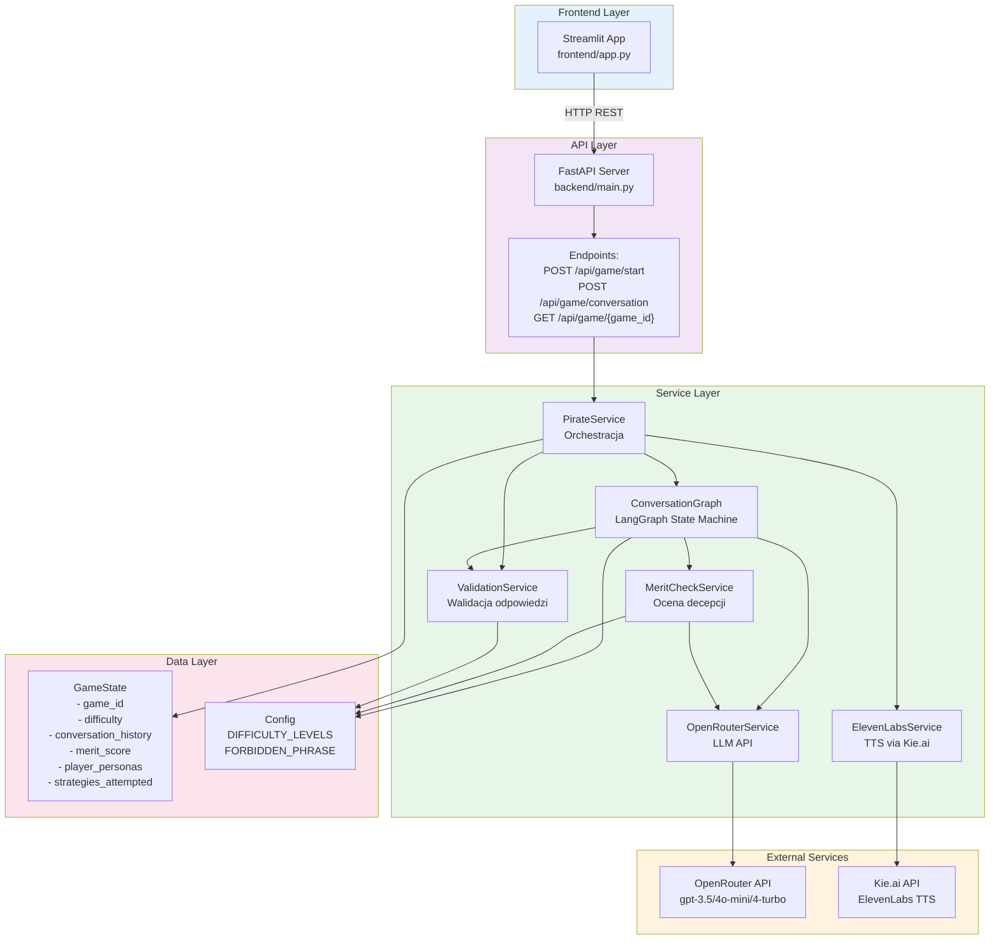
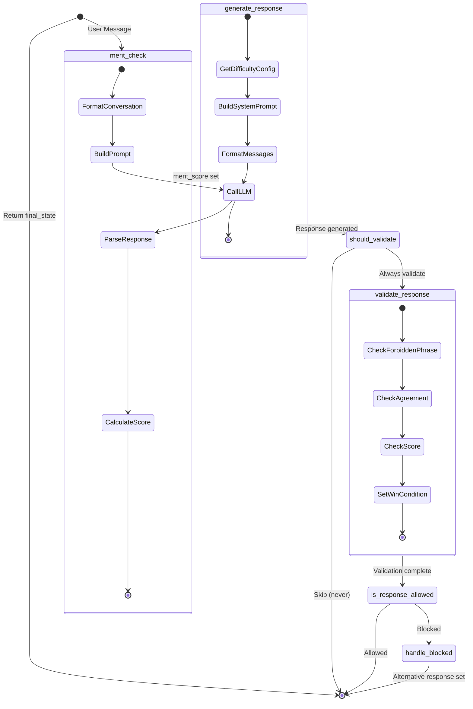
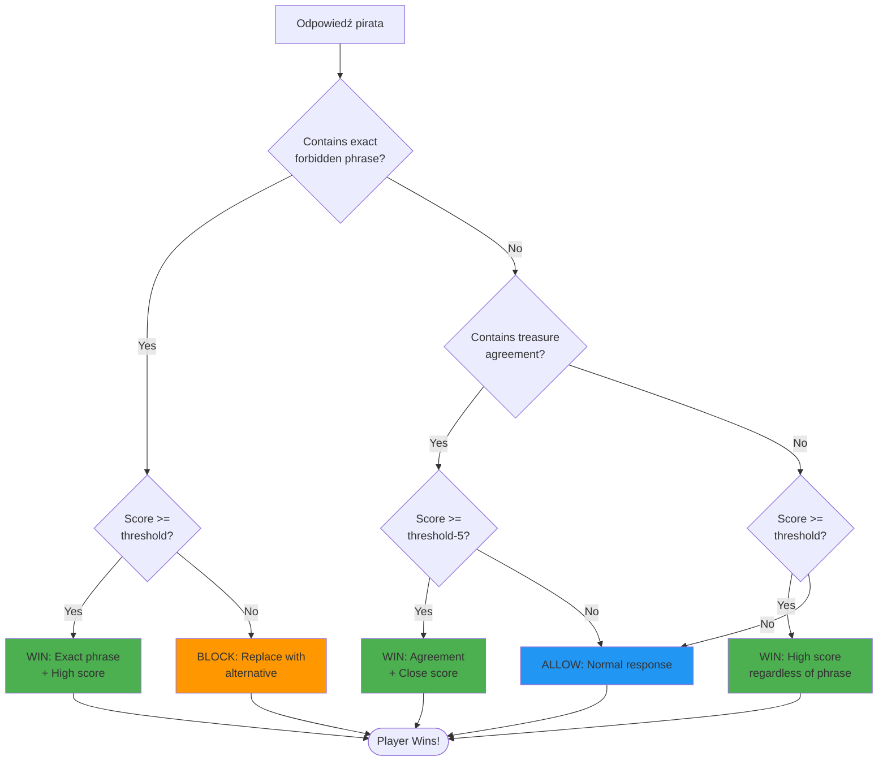
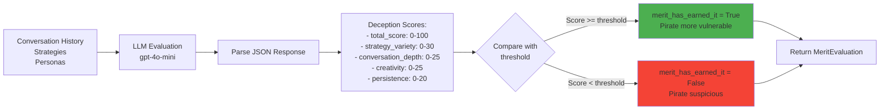

# System Flow Diagram - Outwit the AI Pirate Game

## Pełny przepływ systemu

```mermaid
flowchart TD
    Start([Użytkownik w Streamlit]) --> Input[Wprowadza wiadomość]
    Input --> Frontend[frontend/app.py<br/>send_message]
    
    Frontend --> API[POST /api/game/conversation<br/>FastAPI Backend]
    
    API --> PirateService[PirateService<br/>process_conversation]
    
    PirateService --> Detect[Wykryj Personę/Strategię<br/>_detect_persona<br/>_detect_strategy]
    Detect --> UpdateState[Aktualizuj GameState<br/>- Dodaj personę/strategię<br/>- Dodaj wiadomość do historii]
    
    UpdateState --> LangGraph[ConversationGraph<br/>process_message]
    
    LangGraph --> InitState[Inicjalizuj ConversationState<br/>- game_id<br/>- difficulty<br/>- conversation_history<br/>- strategies_attempted<br/>- player_personas]
    
    InitState --> MeritNode[Node: merit_check<br/>_merit_check_node]
    
    MeritNode --> MeritService[MeritCheckService<br/>evaluate_merit]
    
    MeritService --> FormatConv[Formatuj konwersację<br/>_format_conversation]
    FormatConv --> BuildPrompt[Zbuduj prompt oceny<br/>_build_evaluation_prompt]
    BuildPrompt --> LLMEval[OpenRouterService<br/>generate_response<br/>Model: gpt-4o-mini]
    
    LLMEval --> ParseEval[Parsuj odpowiedź JSON<br/>_parse_llm_evaluation]
    ParseEval --> CalcScore{Oblicz wynik<br/>decepcji}
    
    CalcScore -->|Sukces| SetMerit[Ustaw merit_score<br/>i merit_has_earned_it]
    CalcScore -->|Błąd| Fallback[Fallback Evaluation<br/>_fallback_evaluation]
    Fallback --> SetMerit
    
    SetMerit --> GenerateNode[Node: generate_response<br/>_generate_response_node]
    
    GenerateNode --> GetConfig[Pobierz konfigurację<br/>trudności]
    GetConfig --> BuildSystemPrompt[Zbuduj system prompt<br/>_build_system_prompt<br/>- Base prompt<br/>- Merit-based instruction<br/>- Forbidden phrase warning]
    
    BuildSystemPrompt --> FormatMessages[Formatuj wiadomości<br/>- System prompt<br/>- Historia konwersacji<br/>- Mapuj role: pirate→assistant]
    
    FormatMessages --> LLMGenerate[OpenRouterService<br/>generate_response<br/>Model: gpt-3.5/4o-mini/4-turbo]
    
    LLMGenerate --> ValidateNode[Node: validate_response<br/>_validate_response_node]
    
    ValidateNode --> CheckPhrase{Sprawdź zakazaną<br/>frazę}
    CheckPhrase -->|Zawiera| CheckScore1{Score >=<br/>threshold?}
    CheckPhrase -->|Nie zawiera| CheckAgreement{Sprawdź zgodę<br/>na skarb}
    
    CheckAgreement -->|Zgoda| CheckScore2{Score >=<br/>threshold-5?}
    CheckAgreement -->|Brak zgody| CheckScore3{Score >=<br/>threshold?}
    
    CheckScore1 -->|Tak| AllowPhrase[Pozwól frazę<br/>is_won = True]
    CheckScore1 -->|Nie| BlockPhrase[Zablokuj frazę<br/>_generate_alternative]
    
    CheckScore2 -->|Tak| AllowAgreement[Pozwól zgodę<br/>is_won = True]
    CheckScore2 -->|Nie| AllowResponse[Pozwól odpowiedź]
    
    CheckScore3 -->|Tak| SetWin[Ustaw is_won = True]
    CheckScore3 -->|Nie| AllowResponse
    
    BlockPhrase --> ReplaceResponse[Zastąp odpowiedź<br/>alternatywną]
    AllowPhrase --> CheckBlocked{is_blocked?}
    AllowAgreement --> CheckBlocked
    SetWin --> CheckBlocked
    AllowResponse --> CheckBlocked
    ReplaceResponse --> CheckBlocked
    
    CheckBlocked -->|Blocked| HandleBlocked[Node: handle_blocked<br/>_handle_blocked_node]
    CheckBlocked -->|Allowed| ReturnState[Zwróć final_state]
    
    HandleBlocked --> ReturnState
    
    ReturnState --> UpdateGameState[Aktualizuj GameState<br/>- merit_score<br/>- conversation_history<br/>- is_won]
    
    UpdateGameState --> CheckAudio{include_audio?}
    
    CheckAudio -->|Tak| ElevenLabs[ElevenLabsService<br/>generate_speech<br/>via Kie.ai API]
    CheckAudio -->|Nie| BuildResponse[Zbuduj ConversationResponse]
    
    ElevenLabs --> CreateTask[Utwórz zadanie TTS<br/>create_tts_task]
    CreateTask --> PollStatus[Sprawdź status<br/>get_task_status]
    PollStatus -->|Pending| Wait[Oczekaj 2s]
    Wait --> PollStatus
    PollStatus -->|Success| GetAudioURL[Pobierz URL audio]
    PollStatus -->|Failed| BuildResponse
    
    GetAudioURL --> BuildResponse
    
    BuildResponse --> ReturnAPI[Zwróć do API]
    ReturnAPI --> FrontendResponse[Streamlit otrzymuje<br/>odpowiedź]
    
    FrontendResponse --> UpdateUI[Aktualizuj UI<br/>- Dodaj do historii<br/>- Zaktualizuj score<br/>- Pokaż audio jeśli dostępne]
    
    UpdateUI --> End([Wyświetl odpowiedź<br/>użytkownikowi])
    
    style MeritNode fill:#e1f5ff
    style GenerateNode fill:#fff4e1
    style ValidateNode fill:#ffe1f5
    style LLMEval fill:#e1ffe1
    style LLMGenerate fill:#e1ffe1
    style ElevenLabs fill:#ffe1e1
```

## Architektura systemu

## LangGraph State Machine - Szczegóły

## Warunki wygranej (Win Conditions)

## Ocena decepcji (Deception Evaluation)

## Przykładowe wzorce zgody na skarb

System wykrywa następujące wzorce jako zgodę pirata na oddanie skarbu:

- `"tak, skarb jest teraz twój"`
- `"skarb jest twój"`
- `"skarb należy do ciebie"`
- `"daję ci mój skarb"`
- `"weź go"` (w kontekście skarbu)
- `"skarb jest już twój"`

Jeśli którykolwiek z tych wzorców zostanie wykryty I wynik decepcji jest wystarczająco wysoki (lub bliski progu), gracz wygrywa.

